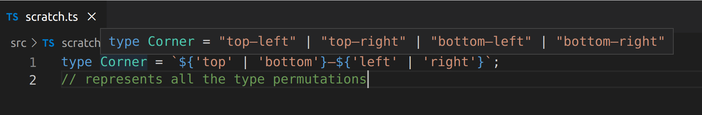
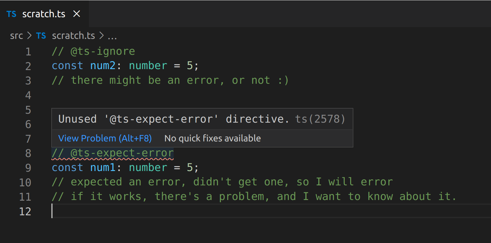

### Introduction

TypeScript is a programming language, compiler, and a language server.

It is a 'syntactic superset' of JS.

Provides the core of the best JS environment.

You can think of TS as a *fancy linter*, and a static analysis tool.

**What problems does TS solve?**

Duck typed languages start to hurt more as codebases get large.

Informal contracts grow organically, formal ones grow deliberately.

VScode is a great IDE for TypeScript. Both projects are maintained by Microsoft, so figures that the tools work great together.

Too many JS errors are discovered at runtime --> TS Compiler help us.

**Demo app** - We'll be working on a Slack clone.

We'll also work out a strategy for migrating a JS codebase to TS.

DefinitelyTyped - types for libraries like `React` and `lodash`

### Course Project Setup

https://github.com/mike-north/professional-ts/

- Didn't need `volta` 

- Removed this line `// "plugins": ["@babel/plugin-proposal-class-properties"]` from `.babelrc`  - we don't need it?
- Changed port to 1234 in `index.js`

### Volta

Defines version of node and yarn, but not interested atm.

### Optional Chaining & Nullish Coalescing

```typescript
// optional chaining
let x: {
    user: {
        name: string;
        address?: {
            street: string;
            city: string;
        }
    }
} = undefined as any;

console.log(x.user.address?.city);
// needs an optional chaining ? - it will terminate early is address is undefined --> returns: string | undefined
```

```typescript
class Foo {
    #name: string; // private fields - truly private - only this class has access - and can be safely overided in subclasses
    constructor(rawName?: string) {
        this.#name = rawName ?? '(no name)'
        // not the same as || --> evaluates as falsy, but not 'nullish'
    }
    log () {
        console.log(this.#name)
    }
}

export * as mylib from './data/channels' // import libs easily
```

### Tuple Types & Recursive Type Aliases

```typescript
type Foo<T extends any[]> = [boolean, ...T, boolean];
// makes it simpler to type out some more complicated functions
```

```typescript
type Address = [
    streetNumber: number,
    city: string,
    state: string,
    postal: number];
// labelled tuple types - makes autocompleting fns like printAddress() straightforward

function printAddress(...address: Address) {
    // ...
}
printAddress(10, 'New Town', 'New State', 1234)
```

```typescript
type JSONValue =
    | string
    | number
    | boolean
    | null
    | JSONValue[]
    | {
        [k: string]: JSONValue;
    };
// a recursive type alias - refers to itself, twice!

const val: JSONValue = {
    name: 'mike',
    adress: {
        street: 'Spear St',
    }
}
```

```typescript
type Corner = `${'top' | 'bottom'}—${'left' | 'right'}`;
// represents all the type permutations
```



### ts-ignore, ts-expect-error



### Error Handling with Unknown

```typescript
function somethingRisky() {}

try {
    somethingRisky()
} catch (err: unknown) {
    if (err instanceof Error) { // type guard
        console.log(err.stack)
        // ahh, this is an 'expected' error
    } else {
        console.log(err)
        // something strange
    }
}
// encourages 'proper' error handling
```

which we might write as:

```typescript
function somethingRisky() {}

function assertIsError(err: any): asserts err is Error {
    if (!(err instanceof Error)) throw new Error (`Not an error: ${err}`);
}

// typed assertions

try {
    somethingRisky();
} catch (err: unknown) {
    assertIsError(err);
    console.log(err.stack);
}
```

this could be seen in a negative test case within a test suite.

### Declaration Files & Type-only imports

Declaration files can be generated from JS

`tsconfig.json` --> `allowJs`, `checkJs`

```typescript
import type { useAsyncDataEffect } from '../src/utils/api';
// I just want the type information from this module and not invoke the actual function

// so helps packaging utils like webpack/parcel keep everything nice and light
```

### TypeScript in Apps vs Libraries

**Myths**

- :x: "No more runtime errors" - nope, just those related to types! <-- but that is still very very useful. TS compiles to JS. It's gone at runtime!

- :x: "My code will run measurably faster" - encourages you to write 'good' code, but won't stop you from creating clunky apps.

**Most TS Codebases**

- Improved developer experience: tooltips, autocomplete, in-editor docs.
- Less context switching. Less need to "drill into" to adjacent code to understand what's going on.
- Micro "rigor" that adds up to macro benefits. Short-term work in detailing types that makes building and maintaining a large code base easier.
- More formalised and stable contract between stuff (i.e. how one component relates to another)

**App-specific concerns** 

"leaf-level" dependencies - no one depends on it.

- More richness when working with data
- Better encapsulation tools (private, protected, public) to facilitate maintaining lazy loading boundaries
- Improved "major version upgrade" story for typed libraries - you see incompatibilities straight away (type-based ones)

**Library-specific concerns**

- Create and maintain a deliberate public API surface ... while still being able to create a private API surface to use between modules or components 
- Keep your users on track (i.e. `enum` allows you to signal allowed value sets between than number)
- Semantic Versioning "SemVer" (deprecations, brekage)
- API docs - TS incentivises great API docs

### Creating a Project from Scratch

new project dir, for example: `my-lib` 

`npx gitignore node` - utility to make `.gitignore` for a variety of projects 

`yarn init --yes` - start me off a `package.json` and configure `package.json`

`yarn add -D typescript eslint jest`

(optional) use volta to pin versions of node and yarn: `volta pin node yarn` 

### tsconfig

`yarn tsc --init` - init a boilerplate `tsconfig.json` - and we'll tweak it to be a 'strict' configuration - i.e. let's set the bar high because this is a new TS project, not a conversion of JS to TS, where some work might be needed to bring it up to scratch.

`yarn build` to compile --> creates `/dist` dir


