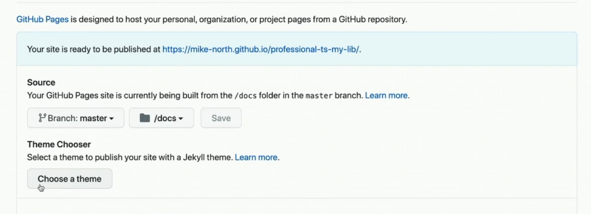

### Introduction

TypeScript is a programming language, compiler, and a language server.

It is a 'syntactic superset' of JS.

Provides the core of the best JS environment.

You can think of TS as a *fancy linter*, and a static analysis tool.

**What problems does TS solve?**

Duck typed languages start to hurt more as codebases get large.

Informal contracts grow organically, formal ones grow deliberately.

VScode is a great IDE for TypeScript. Both projects are maintained by Microsoft, so figures that the tools work great together.

Too many JS errors are discovered at runtime --> TS Compiler help us.

**Demo app** - We'll be working on a Slack clone.

We'll also work out a strategy for migrating a JS codebase to TS.

DefinitelyTyped - types for libraries like `React` and `lodash`

### Course Project Setup

https://github.com/mike-north/professional-ts/

- Didn't need `volta` 

- Removed this line `// "plugins": ["@babel/plugin-proposal-class-properties"]` from `.babelrc`  - we don't need it?
- Changed port to 1234 in `index.js`

### Volta

Defines version of node and yarn, but not interested atm.

### Optional Chaining & Nullish Coalescing

```typescript
// optional chaining
let x: {
    user: {
        name: string;
        address?: {
            street: string;
            city: string;
        }
    }
} = undefined as any;

console.log(x.user.address?.city);
// needs an optional chaining ? - it will terminate early is address is undefined --> returns: string | undefined
```

```typescript
class Foo {
    #name: string; // private fields - truly private - only this class has access - and can be safely overided in subclasses
    constructor(rawName?: string) {
        this.#name = rawName ?? '(no name)'
        // not the same as || --> evaluates as falsy, but not 'nullish'
    }
    log () {
        console.log(this.#name)
    }
}

export * as mylib from './data/channels' // import libs easily
```

### Tuple Types & Recursive Type Aliases

```typescript
type Foo<T extends any[]> = [boolean, ...T, boolean];
// makes it simpler to type out some more complicated functions
```

```typescript
type Address = [
    streetNumber: number,
    city: string,
    state: string,
    postal: number];
// labelled tuple types - makes autocompleting fns like printAddress() straightforward

function printAddress(...address: Address) {
    // ...
}
printAddress(10, 'New Town', 'New State', 1234)
```

```typescript
type JSONValue =
    | string
    | number
    | boolean
    | null
    | JSONValue[]
    | {
        [k: string]: JSONValue;
    };
// a recursive type alias - refers to itself, twice!

const val: JSONValue = {
    name: 'mike',
    adress: {
        street: 'Spear St',
    }
}
```

```typescript
type Corner = `${'top' | 'bottom'}—${'left' | 'right'}`;
// represents all the type permutations
```


### ts-ignore, ts-expect-error


### Error Handling with Unknown

```typescript
function somethingRisky() {}

try {
    somethingRisky()
} catch (err: unknown) {
    if (err instanceof Error) { // type guard
        console.log(err.stack)
        // ahh, this is an 'expected' error
    } else {
        console.log(err)
        // something strange
    }
}
// encourages 'proper' error handling
```

which we might write as:

```typescript
function somethingRisky() {}

function assertIsError(err: any): asserts err is Error {
    if (!(err instanceof Error)) throw new Error (`Not an error: ${err}`);
}

// typed assertions

try {
    somethingRisky();
} catch (err: unknown) {
    assertIsError(err);
    console.log(err.stack);
}
```

this could be seen in a negative test case within a test suite.

### Declaration Files & Type-only imports

Declaration files can be generated from JS

`tsconfig.json` --> `allowJs`, `checkJs`

```typescript
import type { useAsyncDataEffect } from '../src/utils/api';
// I just want the type information from this module and not invoke the actual function

// so helps packaging utils like webpack/parcel keep everything nice and light
```

### TypeScript in Apps vs Libraries

**Myths**

- :x: "No more runtime errors" - nope, just those related to types! <-- but that is still very very useful. TS compiles to JS. It's gone at runtime!

- :x: "My code will run measurably faster" - encourages you to write 'good' code, but won't stop you from creating clunky apps.

**Most TS Codebases**

- Improved developer experience: tooltips, autocomplete, in-editor docs.
- Less context switching. Less need to "drill into" to adjacent code to understand what's going on.
- Micro "rigor" that adds up to macro benefits. Short-term work in detailing types that makes building and maintaining a large code base easier.
- More formalised and stable contract between stuff (i.e. how one component relates to another)

**App-specific concerns** 

"leaf-level" dependencies - no one depends on it.

- More richness when working with data
- Better encapsulation tools (private, protected, public) to facilitate maintaining lazy loading boundaries
- Improved "major version upgrade" story for typed libraries - you see incompatibilities straight away (type-based ones)

**Library-specific concerns**

- Create and maintain a deliberate public API surface ... while still being able to create a private API surface to use between modules or components 
- Keep your users on track (i.e. `enum` allows you to signal allowed value sets between than number)
- Semantic Versioning "SemVer" (deprecations, brekage)
- API docs - TS incentivises great API docs

### Creating a Project from Scratch

new project dir, for example: `my-lib` 

`npx gitignore node` - utility to make `.gitignore` for a variety of projects 

`yarn init --yes` - start me off a `package.json` and configure `package.json`

`yarn add -D typescript eslint jest`

(optional) use volta to pin versions of node and yarn: `volta pin node yarn` 

### tsconfig

`yarn tsc --init` - init a boilerplate `tsconfig.json` - and we'll tweak it to be a 'strict' configuration - i.e. let's set the bar high because this is a new TS project, not a conversion of JS to TS, where some work might be needed to bring it up to scratch.

`yarn build` to compile --> creates `/dist` dir

### Configuring ESLint

`yarn eslint --init` - convenient wizard

`rm package-lock.json` as we're going with yarn

then run `yarn` to patch up `yarn.lock`

and we tweak `.eslintrc.json` a little

We also need to create a tsconfig specifically for eslint `tsconfig.eslint.json` - this extends `tsconfig.json` - need to add `"project": "tsconfig.eslint.json"` to `.eslintrc.json` - this is all convoluted, but it's set and forget.

### Testing

`yarn add -D jest @types/jest @babel/preset-env @babel/preset-typescript`

`mkdir tests` and make a `index.test.ts` inside that

tests need their own `tsconfig.json` because of some import rules we set up earlier. This extends `../tsconfig.json`

create a `.babelrc`

### API Extractor Setup

API documentation tool

`yarn add -D @microsoft/api-extractor @microsoft/api-documenter`

`yarn api-extractor init` --> `api-extractor.json` and configure the file...

### Running API Extractor

`mkdir etc`

`yarn api-extractor run --local` which creates an 'API report' in `etc/my-lib.api.md` 

add `/temp` to `.gitignore` - `/temp` is more of a staging area

normally we run `yarn api-extractor run` in CI

### API Documenter

`yarn api-documenter markdown -i temp -o docs` to generate the docs!

on Github we can use *Github Pages* to host our very own doc site.



Alternatives: https://typedoc.org/, https://esdoc.org/ 

each with their pros and cons.

and more ... https://mike-north.github.io/js-documentation-cases/

*API Extractor* is the presenter's favourite. The docs look basic, but its the most trustworthy.

### strict In-Depth

Beware, strict includes more than things that just begin with `strict` ... e.g. `noImplicitAny`: 

```typescript
// e.g. - even though b is obviously type number...

function sum2(a: number, b): number {
	// not allowed
}

function sum2(a: number, b:any): number {
	// not allowed - the author MUST tell us it is type any
}
```

`noImplicitThis`:

```typescript
declare const elem: HTMLButtonElement;

elem.addEventListener("click", function () {
  console.log(this.className);
  // TS knows 'this' is an HTMLButtonElement
})
```

`strictNullChecks`:

```typescript
// if (s) {
  s.split(',') // this now errors without a guard statement.
// }
```

`strictFunctionTypes`, ... and more!

### Even more strict

`noImplicitReturns` 

```typescript
function sum2(a: number, b: number) { // not allowed
  const sum = a + b;
  return sum;
}

function sum2(a: number, b: number): number { // must say what the fn returns... a number!
  const sum = a + b;
  return sum;
}
```

and more ...

### Viral Options

avoid these:

`allowSyntheticDefaultImports`

 `esModuleInterop`

`skipLibCheck`

### Converting a Project to TypeScript

Now we've configured a new TS project `my-lib`, let's focusing on the Slack clone, which we'll convert from JS to TS.

**What not to do**

- Functional changes at the same time
- Attempt this with low test coverage
- Let 'perfect be enemy of the good'
- Forget to add tests for your types
- Publish types for consumer use while they're in a "weak" state - this is the last step, once your ready to publish declarations

**1. Compiling in "loose mode"**

- Start with tests passing
- Rename all `.js` to `.ts` allowing implicit any
- Fix only what's not type-checking or causing compile errors
- **Be careful to avoid chaning behaviour**
- Get tests passing again

**2. Explicit Any**

- Start with tests passing
- Ban implicit any `{"noImplicitAny": true}`
- Where possible, provide a specific and appropriate type
  - Import types for deps from `DefinitelyTyped`
  - otherwise `eplicit` any
- ... get tests passing again

**3. Squash explicit anys, enable strict mode**

- Incrementally, in small chunks

- Enable strict mode

  ```json
  "strictNullChecks": true,
  "strict": true,
  "strictFunctionTypes": true,
  "strictBindCallApply": true
  ```

- Replace explicit anys w/ more appropriate types

- Try really hard to avoid unsafe casts

### Typing a Project to strict

**Step 3 is 80% of the work**

To make this easier, let's break it up:

3.1) strict mode 

```json
// tsconfig.json
"compilerOptions": {
	"strict": true,
}
```

3.2) more strict mode

```json
// tsconfig.json
"compilerOptions": {
	"strict": true,
    "noUnsedLocals": true,
    "stripInternal": true,
    "types": [],
    "forceConsistentCasingInFilesNames": true
}
```

3.3) TS-specific linting

```json
// .eslintrc
"parser": "@typescript-eslint/parser",
"extends": [
    "prettier/@typescript-eslint",
    "plugin:@typescript-eslint/recommended",
    "plugin@typescript-eslint/recommended-requiring-type-checking"
]
```

3.4) Even more strict mode

```json
// .eslintrc
"rules": {
    "@typescript-eslint/no-unsafe-assignment": "on",
    "@typescript-eslint/no-unsafe-return": "on",
    "@typescript-eslint/no-explicit-any": "on"
}
```

run these commands in [./professional-ts](./professional-ts) to rename everything:

```shell
# rename all JSX files in src/ to TSX
find src -name '*.jsx' -exec bash -c 'git mv "$0" "${0%.jsx}.tsx"' "{}" \;
# rename all JS files in src/ to TS
find src -name '*.js' -exec bash -c 'git mv "$0" "${0%.js}.ts"' "{}" \;
# rename all JSX files in src/ to TSX
find tests -name '*.jsx' -exec bash -c 'git mv "$0" "${0%.jsx}.tsx"' "{}" \;
# rename all JSX files in src/ to TSX
find tests -name '*.jsx.snap' -exec bash -c 'git mv "$0" "${0%.jsx.snap}.tsx.snap"' "{}" \;
# rename all JS files in tests/ to TS
find tests -name '*.js' -exec bash -c 'git mv "$0" "${0%.js}.ts"' "{}" \;
```

change the entry point to `src="src/index.ts"` in `index.html`

then run `tsc` --> errors!

we need to dial the compiler down: [commit1](https://github.com/thomashoddinott/fem-production-grade-typescript/commit/6d72c138806761ebdb1b223e7b181afc5d2072d7), [commit2](https://github.com/thomashoddinott/fem-production-grade-typescript/commit/7e82f3f0cb5655a608fc584317f6d91993ca4b5a), [commit3](https://github.com/thomashoddinott/fem-production-grade-typescript/commit/ea00cbdfc33b9fef78e68ddce94138c69ba43d59)

### Typing React Components

[commit](https://github.com/thomashoddinott/fem-production-grade-typescript/commit/c09272c706055401555c42df24713413c6ee600c)

### Typing 3rd Party Libraries

Switching `"noImplicitAny": true` and fixing all the new errors!

`tsc --watch --preserveWatchOutput`

[commit](https://github.com/thomashoddinott/fem-production-grade-typescript/commit/ad7e2689f8aaa9458c744b9221e388c0027d6fc2)

### Enabling Stricter Settings

[commit](https://github.com/thomashoddinott/fem-production-grade-typescript/commit/f3cd4a674b0f7b275e668329ebe3206510279e56)

## Using ESLint

configuring `.eslintrc` - [commit](https://github.com/thomashoddinott/fem-production-grade-typescript/commit/d72b4576747c891cbf0b6485997373d1e234d33f)

more getting eslint to pass after configuring it ... - [commit](https://github.com/thomashoddinott/fem-production-grade-typescript/commit/2a0377234872eb261a06b6c49363c65fc808bfd0)

### Using Interfaces

Interfaces are type information.

We can house a collection of interfaces in a `src/types.ts` file.

e.g:

```typescript
// src/types.ts

  /**
   * A team, containing one or more chat channels
   */
  export interface ITeam { // naming convention is to prefix with I for interfances 
    iconUrl: string;
    name: string;
    id: string;
    channels: IChannel[];
  }
```

and import it with:

```typescript
import type { ITeam } from '../types';
```

### Local Type Overrides

Sometimes you'll find incorrect types in packages like DefinitelyTyped. We need to know how to override them if so.

At the top level make a directory called `types/` and add the path in `tsconfig.json`:

```json
"baseUrl": ".",
"paths": {
   "*": ["types/*"]
 }
```

And then put declarations there. For example:

```typescript
// types/react/index.d.ts

export function foo(): void;

// ...
```

We intercept the compiler with our custom types. It's the place to patch things up.

### Types at Runtime

[commit](https://github.com/thomashoddinott/fem-production-grade-typescript/commit/c09325e4c935a9ea66fbb396befdb069f6a9d917) - a bit complicated, might need to re-watch!

### Tests for Types

Types need tests too. But they are a different type of test to write.

Our Jest tests cover positive test cases: things that *should work and do work*. 

It's harder to write tests for negative test cases in Jest: things that *shouldn't work and must not work*.

**TS doesn't follow semantic versioning!** - every middle release of TS introduces **breaking changes**. 

TS team philosophy: "there's no such thing as a non-breaking change".

Therefore TS team may have to go and fix bugs they've introduced. 

e.g. You can setup your project (on Github, Gitlab, BitBucket, etc.) to test against the latest (nightly) build of TS, catching errors as they as introduced. <-- Early warning system.

### dtslint Setup

read carefully - https://github.com/microsoft/dtslint 

^ this tool isn't designed for what we're using it for, but we're using it anyway...

`tslint.json` is deprecated, yet we use it here...


